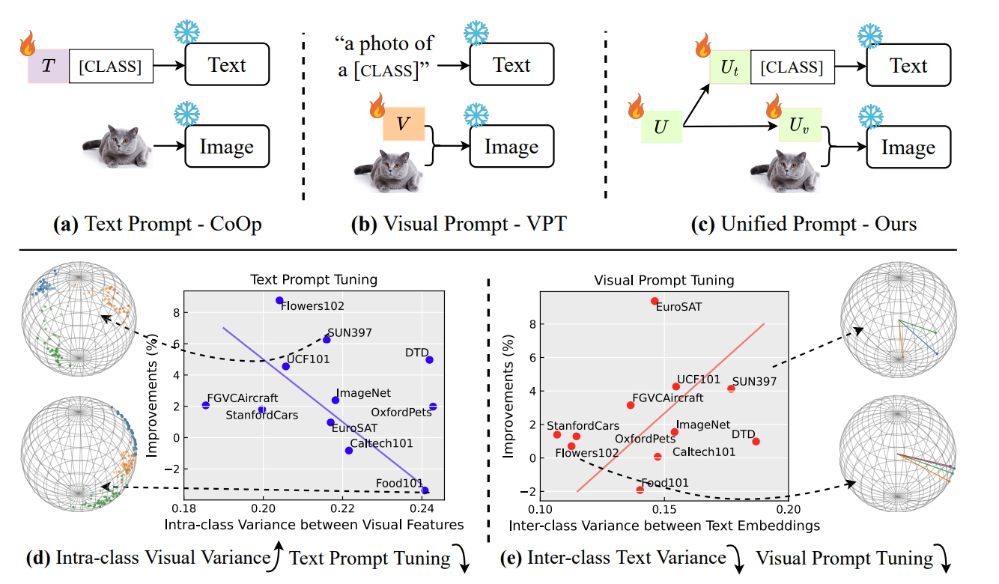

<h1 align="center"> Unified Vision and Language Prompt Learning </h1>

<h2 align="center">
  <a href="https://arxiv.org/pdf/2210.07225.pdf">arXiv</a> |
  <a href="https://github.com/yuhangzang/UPT">Code</a>
</h2>

> **Unified Vision and Language Prompt Learning** 
> Yuhang Zang, Wei Li, Kaiyang Zhou, Chen Huang, Chen Change Loy 
> arXiv, 2022 

  

## How to run

This code is based on [CoOp](https://github.com/KaiyangZhou/CoOp), you may refer to the [install instruction](https://github.com/KaiyangZhou/CoOp?tab=readme-ov-file#how-to-install).

The training scripts to reproduce the results are provided [here](scripts/unified). Ensure the `DATA` variable in the scripts points to your dataset directory.

The model structure is defined [here](trainers/unified.py).
